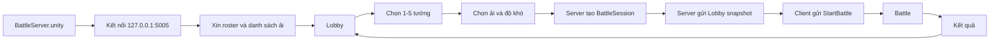
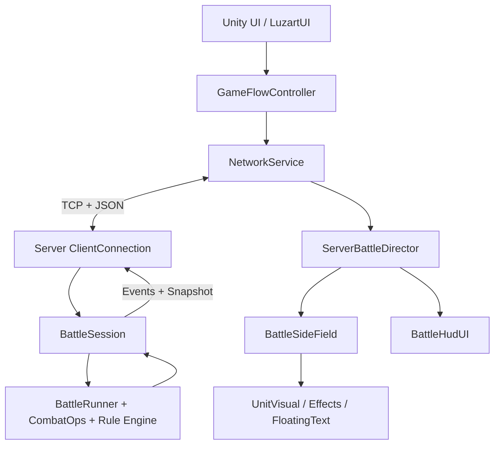
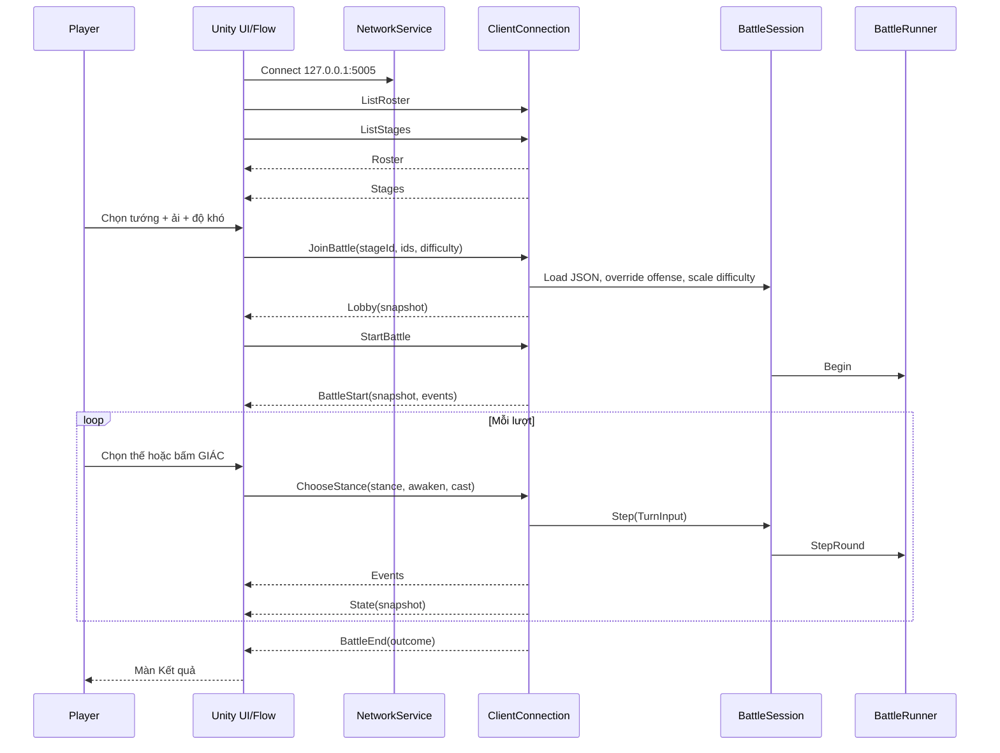

# Tổng quan game CTXD từ Game Design đến hệ thống và Client–Server

## Mục đích tài liệu

Tài liệu này dành cho người chưa biết gì về game hoặc codebase. Nó trả lời bốn câu hỏi:

1. Game gốc là game gì và người chơi làm gì?
2. Các hệ thống theo Game Design liên kết với nhau thế nào?
3. Bản Unity hiện tại đã hiện thực được phần nào?
4. Client và server trao đổi, tính trận và hiển thị kết quả ra sao?

Điểm quan trọng nhất:

> Game gốc là một SLG Tam Quốc rất lớn. Repo hiện tại mới là một **vertical slice/prototype tập trung vào chiến đấu**, có luồng Sảnh → Chọn tướng → Chọn ải → Đánh → Kết quả. Không nên hiểu các hệ thống được mô tả trong GDD đều đã tồn tại trong bản Unity.

---

## 1. Ba lớp phải phân biệt

Repo chứa ba lớp thông tin khác nhau:

| Lớp | Ý nghĩa | Nguồn chính |
|---|---|---|
| **Game gốc** | 《攻城掠地》/Công Thành Lược Địa, bản Việt “Xưng Đế Công Thành”; game thương mại hoàn chỉnh | `reference-gcld-client/GDD.md`, mã Lua dịch ngược trong `reference-gcld-client/decompiled/` |
| **Thiết kế bản dựng lại** | GDD và quyết định thiết kế dùng để định hướng remake | `.wiki/wiki/GDD.md`, `.wiki/wiki/systems/`, `.wiki/wiki/decisions/` |
| **Code đang chạy** | Những gì project Unity + fake server đã thực sự hiện thực | `Assets/Ctxd/`, `Server/`, `Tests/CtxdSim.Tests/` |

Khi ba lớp mâu thuẫn, thứ tự dùng để hiểu **trạng thái hiện tại** là:

1. Code và dữ liệu hiện tại.
2. Test hiện tại.
3. Quyết định kỹ thuật mới nhất.
4. Wiki/GDD cũ.

Một số trang `.wiki/` vẫn ghi “chưa có gameplay code”, Unity 6.5 hoặc URP. Các nhận định đó đã cũ. Project hiện dùng Unity `6000.2.8f1`; `Assets/Ctxd/` và server chiến đấu đã tồn tại.

---

## 2. Game này là game gì?

### 2.1. Định danh

- Thể loại: SLG chiến thuật Tam Quốc.
- Trục chính: thu thập và phát triển tướng, đánh phó bản, công thành, nội chính, quốc chiến và hoạt động liên server.
- Game gốc dùng Cocos2d-x + LuaJIT.
- Bản dựng lại trong repo dùng Unity 6.0, C# và một fake server .NET 8.
- Game gốc và bản dựng lại đều theo nguyên tắc **server-authoritative**: server quyết định kết quả, client chủ yếu nhập lệnh và trình diễn.

Nguồn: `reference-gcld-client/README.md`, `reference-gcld-client/GDD.md`, `ProjectSettings/ProjectVersion.txt`.

### 2.2. Fantasy của người chơi

Người chơi đóng vai một Chủ Công:

1. Thu thập và sắp đội hình tướng.
2. Đem quân đánh các chiến dịch Tam Quốc.
3. Dùng tài nguyên và phần thưởng để tăng sức mạnh.
4. Mở khóa tướng, công nghệ, công trình và chế độ mới.
5. Tham gia chiến tranh Ngụy–Thục–Ngô và các hoạt động liên server.

### 2.3. Các trụ cột Game Design

1. **Chiến đấu ít thao tác nhưng có quyết định**: chọn thế trận, canh chiến pháp và giác tỉnh.
2. **Tướng là trục phát triển chính**: chiêu mộ, tăng cấp, trang bị, thức tỉnh.
3. **Công thành chiếm đất**: PvE chiến dịch và chiến tranh trên bản đồ.
4. **Tiến trình dài hạn**: nội chính, kinh tế, công nghệ, trang bị, quốc gia.
5. **Hoạt động tập thể và live-ops**: quốc chiến, boss, giải đấu, cross-server, sự kiện mùa.

### 2.4. Core loop của game gốc

```text
Đánh phó bản / công thành / quốc chiến
                    ↓
Nhận EXP + tài nguyên + trang bị + mảnh/tướng
                    ↓
Nâng tướng + quân + công trình + công nghệ
                    ↓
Mở mục tiêu khó hơn và hệ thống mới
                    └──────────────────────────────↺
```

Ba nhịp chơi:

- **Ngắn:** vào trận, chọn thế, dùng chiến pháp, nhận kết quả.
- **Ngày:** nhiệm vụ, phó bản, quốc chiến, boss, sự kiện.
- **Dài:** nuôi tướng, trang bị, thức tỉnh, nội chính, quốc gia và cross-server.

---

## 3. Toàn bộ hệ thống theo góc nhìn Game Design

### 3.1. Bảng trạng thái tổng hợp

| Hệ thống | Vai trò trong game gốc/GDD | Trạng thái trong bản hiện tại |
|---|---|---|
| Tài khoản/đăng nhập | Danh tính, phiên, nhân vật, shard | **Chưa có** |
| Chủ Công | Cấp, tài nguyên, tiến độ | Tên/cấp/tài nguyên trên Lobby là **stub** |
| Lobby/chủ thành | Hub vào nội chính, tướng, bản đồ, shop | Có màn Lobby; phần lớn nút bị khóa |
| Chọn tướng | Lập đội và thứ tự xuất trận | **Có**, tối đa 5 tướng |
| Campaign/phó bản | Chọn ải, độ khó, phần thưởng, mở khóa | **Có lát mỏng:** 3 ải, 5 độ khó |
| Battle | Lõi đấu theo lượt, server tính | **Có và được test** |
| Thế trận | Đột Kích/Tấn Công/Phòng Thủ khắc chế vòng | **Có** |
| Nộ/chiến pháp | Tích thanh, bấm dùng skill, khống chế/AoE | **Có một phần** |
| Rule-engine skill | Skill nhắm hàng/nhóm/binh chủng theo data | **Có** |
| Đội hình hàng–nhóm | Tướng có nhiều hàng, mỗi hàng nhiều nhóm | **Có** |
| Binh chủng | Kỵ/Thương/Cung/Khí giới và biến thể | Có 5 enum phục vụ prototype |
| Thiên phú địa hình | Tướng được bonus theo địa hình | **Có**, data server |
| Khắc chế binh chủng | Buff/tech/talent theo loại địch | **Có dạng placeholder/tunable** |
| Né/bạo kích/Loạn Vũ/Độ bền | Biến thể giải đòn | **Có** |
| Chuỗi/phản chiến | `nextTacticId`, `beHold` | **Có dạng đơn giản hóa** |
| Phantom/ảo ảnh | Sao chép quân, nối vào trận | Có server API; **chưa có UI chính thức** |
| Bao vây/phong tỏa | Phe quá yếu bị khóa chiến pháp và chịu đòn định kỳ | **Có trong sim** |
| Công thành/trụ tên | Trụ bắn, phá trụ, hỏa công | **Có một phần**, gated ở địa hình City |
| Tướng/phẩm chất/chiêu mộ | Roster lớn, quán rượu, phẩm chất | Chỉ có roster JSON 8 tướng; **không có chiêu mộ** |
| Tướng lên cấp/thức tỉnh | Progression dài hạn và nguyên liệu | Cờ/skill chiến đấu có; **không có vòng progression** |
| Trang bị/rèn/đá quý | Tăng sức mạnh và kinh tế vật phẩm | **Chưa có** |
| Trận pháp/binh thư | Layout và buff dài hạn | Có 3 SO mẫu; chưa có progression/UI |
| Nội chính/công trình | Sản xuất Bạc/Gỗ/Lương/Sắt, timer | **Chưa có** |
| Công nghệ | Mở khóa và tăng hiệu suất | **Chưa có** |
| Mộ binh | Hồi quân, tiêu tài nguyên/thời gian | **Chưa có** |
| Bản đồ thế giới | Thành, fog, di chuyển, chiếm đất | **Chưa có** |
| Ngụy–Thục–Ngô/quốc chiến | Trạng thái thế giới chung, PvP tập thể | **Chưa có** |
| Quân đoàn/quốc gia | Xã hội, quyền hạn, nhiệm vụ tập thể | **Chưa có** |
| Boss/giải đấu/cross-server | Endgame và cạnh tranh | **Chưa có** |
| VIP/nạp/shop | Monetization và đặc quyền | **Chưa có** |
| Sự kiện/live-ops | Hoạt động theo mùa/ngày | **Chưa có** |
| Lưu tiến độ | DB, kho đồ, thưởng, tài nguyên | **Chưa có** |

### 3.2. Hệ Tướng

Trong game gốc, tướng và đội quân của tướng là một thực thể thống nhất:

- Tướng có chỉ số, binh chủng, binh lực, chiến pháp, thiên phú và trang bị.
- “Máu” thực chiến chủ yếu được biểu diễn bằng **số quân/binh lực**.
- Tướng được xếp vào hàng đợi; tướng đầu hàng đợi đang giao chiến.
- Khi một tướng hết quân, tướng tiếp theo tiến vào.
- Tướng có thể có phó tướng, thức tỉnh và skill ký danh.

Các chỉ số hiện dùng trong code:

| Field | Nghĩa |
|---|---|
| `NormalAtk` | Công thường |
| `NormalDef` | Thủ thường |
| `TacticAtk` | Công chiến pháp |
| `TacticDef` | Thủ chiến pháp |
| `Strategy` | Kế sách; hiện còn dùng để quyết thứ tự hòa thế và phản/giữ chiến pháp |
| `Resilience` | Xác suất kích hoạt giảm sát thương chiến pháp |
| `MaxTroops/Troops` | Binh lực tối đa/hiện tại |
| `Morale` | Thanh dùng skill |

Code: `Assets/Ctxd/Battle/Sim/Combatant.cs`, `GeneralStats.cs`, `Server/ScenarioLoader.cs`.

### 3.3. Binh chủng

Prototype hiện dùng:

- `KyBinh` — Kỵ binh.
- `ThuongBinh` — Thương/Bộ binh tuyến trước.
- `CungBinh` — Cung binh.
- `ChienXa` — Chiến xa/khí giới.
- `MuuSi` — Mưu sĩ, chủ yếu là nhãn/visual ngoài vòng khắc chế bốn hệ.

Lưu ý về tính trung thực:

- Nguồn dịch ngược xác nhận bốn hệ khắc chế chính Bộ/Kỵ/Cung/Khí giới; `MuuSi` trong prototype là cách mô hình hóa content bản mục tiêu.
- Hệ số khắc chế thật của game gốc nằm ở server gốc và chưa lấy được.
- `BattleConfig` hiện có vòng khắc chế universal và bonus riêng từng tướng. Đây là thiết kế có thể chỉnh, không phải số liệu gốc đã xác minh.

### 3.4. Trận pháp và hình học quân

Mô hình code hiện tại:

```text
Phe
└── Hàng đợi Combatant/Tướng
    └── Formation
        ├── Row 0 (hàng sống đầu tiên đang giao chiến)
        │   ├── Group 0
        │   ├── Group 1
        │   └── Group 2
        ├── Row 1
        ├── Row 2
        └── Row 3
```

Mặc định:

- Một tướng có 4 hàng.
- Một hàng có 3 nhóm.
- Một nhóm dùng lưới visual 3×2 = 6 sprite tượng trưng.
- Số sprite **không bằng** số quân thật. Sáu sprite có thể đại diện hàng nghìn binh lực.
- Server có thể author đội hình trộn nhiều binh chủng ở từng group.

Khi chịu đòn thường:

1. Chỉ hàng sống đầu tiên chịu sát thương.
2. Sát thương rải theo tỷ lệ binh lực giữa các group trong hàng.
3. Hết hàng thì phát sự kiện group chết/hàng tiến.
4. Sát thương thừa tràn sang hàng sống kế tiếp.
5. Hết toàn bộ quân của tướng thì tướng tiếp theo vào trận.

Code: `Formation.cs`, `CombatOps.ApplyDamageToFront`, `BattleSideField.cs`.

### 3.5. Ba thế trận

Vòng khắc chế:

```text
Đột Kích > Tấn Công > Phòng Thủ > Đột Kích
```

Default prototype:

- Thắng thế: nhân `1.5`.
- Thua thế: nhân `0.7`.
- Hòa: nhân `1.0`.
- Bên thắng thế đánh trước.
- Nếu hòa, bên có `Strategy` cao hơn đánh trước.

Các con số trên là tuning của prototype, chưa phải balance game gốc.

### 3.6. Nộ khí/chiến pháp

Luồng hiện tại:

- Tướng thường bắt đầu với 50/100 nộ.
- Tướng `FiveStar` bắt đầu đầy 100.
- Gây sát thương: +12.
- Nhận sát thương: +8.
- Hạ tướng: +30.
- Dùng chiến pháp xong: về 0.
- Chỉ được dùng `Skill2` khi đầy nộ, có skill, không hỗn loạn và không bị bao vây.
- Người chơi phải bấm nút GIÁC/cast; AI tự dùng khi đủ điều kiện.

`Skill1` được nạp vào model nhưng **chưa được BattleRunner dùng trong vòng đánh bình thường**.

### 3.7. PvE/campaign

Game gốc có kịch bản Tam Quốc, năm mức khó, lượt chơi, phantom, mở tướng và phần thưởng.

Prototype có:

- `stage_khanhvang`: Khăn Vàng, địa hình Plain, 3 địch.
- `stage_quando`: Quan Độ, địa hình Pass, 4 địch.
- `stage_xichbich`: Xích Bích, địa hình Water, 5 địch.
- 5 nút khó: Dễ, Thường, Khó, Địa Ngục, Chiến Thần.

Hệ số quân phe Thủ:

| Tier | Tên UI | Hệ số binh lực địch |
|---:|---|---:|
| 1 | Dễ | 1.0 |
| 2 | Thường | 1.0 |
| 3 | Khó | 1.6 |
| 4 | Địa Ngục | 2.4 |
| 5 | Chiến Thần | 3.5 |

Hiện chưa có tiến độ mở khóa, lượt/ngày, tiêu lương, drop table hoặc lưu sao.

### 3.8. Nội chính, trang bị, thế giới và multiplayer

Các hệ này có mô tả khá đầy đủ trong GDD nhưng chưa được code:

- Bạc/Gỗ/Lương/Sắt/Vàng.
- Khu dân cư, mộc trường, nông trường, mỏ, binh doanh, hoàng thành.
- Công nghệ, cải tạo, nô lệ, tơ lụa, mỏ sắt và đồn điền.
- Sáu đến tám nhóm trang bị, bộ đồ, bảo vật, thần binh, đá quý.
- Bản đồ nhiều thành, fog, hành quân, chiếm thành.
- Ba nước Ngụy/Thục/Ngô, quốc chiến, quân đoàn.
- Boss, giải đấu, cross-server, hoạt động mùa.
- VIP, nạp, shop và live-ops.

Các phần này mới là **phạm vi thiết kế**, không phải chức năng đang chạy.

---

## 4. Người chơi làm gì trong bản hiện tại?

### 4.1. Luồng có thể chơi



Scene chính của flow này là:

`Assets/Ctxd/Scenes/BattleServer.unity`

`Assets/Scenes/MainScene.unity` chỉ chứa camera/canvas/event system cơ bản và không phải scene gameplay end-to-end chính.

### 4.2. Lobby

Lobby hiện hiển thị:

- Tên “Chủ Công”.
- Cấp mặc định 60.
- Một dòng tài nguyên mẫu.
- Nút Xuất Chinh và Đội Hình cùng dẫn tới chọn tướng.
- Các nút hệ thống khác bị khóa.

Đây chưa phải dữ liệu tài khoản thật. Code: `Assets/Ctxd/UI/LobbyUI.cs`, `GameFlowController.cs`.

### 4.3. Chọn tướng

- Server gửi 8 `GeneralSummary`.
- UI có tối đa 5 slot.
- Chọn ít nhất 1 tướng là có thể xác nhận.
- Thứ tự bấm thẻ là thứ tự xuất trận.
- Client chỉ thấy dữ liệu tóm tắt: tên, binh chủng, lực chiến, cấp, số hàng, tên skill.
- Chỉ số chiến đấu đầy đủ vẫn ở server JSON.

Roster hiện có:

| Tướng | Binh chủng |
|---|---|
| Quan Vũ | Kỵ |
| Trương Phi | Thương |
| Triệu Vân | Kỵ, có Quan Bình làm phó trong data |
| Mã Siêu | Kỵ |
| Hoàng Trung | Cung |
| Gia Cát Lượng | Mưu sĩ |
| Chu Du | Mưu sĩ |
| Hoàng Nguyệt Anh | Chiến xa |

Nguồn: `Server/data/roster.json`.

### 4.4. Chọn ải

- Danh sách card lấy từ `Server/data/stages.json`.
- Chi tiết đội địch lấy từ file JSON trùng ID, ví dụ `stage_quando.json`.
- UI có property `Locked` trong protocol nhưng `SelectStageUI` hiện chưa dùng nó để khóa card.

### 4.5. Kết quả

Server quyết định thắng/thua, nhưng dòng thưởng hiện được client tự tạo:

- EXP = `1200 + difficulty × 800`.
- Lương = `3000 + difficulty × 500`.
- Mảnh tướng ×1 nếu thắng.

Các phần thưởng này **không được server cấp và không được lưu**. Chúng chỉ là text UI prototype.

Code: `GameFlowController.RewardExp`, `RewardGrain`, `ResultUI.cs`.

---

## 5. Kiến trúc code hiện tại

### 5.1. Bản đồ tầng



| Tầng | Đường dẫn | Trách nhiệm |
|---|---|---|
| Shared Sim | `Assets/Ctxd/Battle/Sim/` | Mô hình trận, RNG, công thức, rule-engine, protocol DTO |
| Server | `Server/` | TCP, session, load JSON, chạy BattleRunner |
| Client network | `Assets/Ctxd/Net/` | Kết nối, gửi command, nhận message trên background thread |
| Flow/UI | `Assets/Ctxd/Battle/GameFlowController.cs`, `Assets/Ctxd/UI/` | Điều hướng và input |
| Presentation | `ServerBattleDirector.cs`, `BattleSideField.cs`, `Assets/Ctxd/Visual/` | Diễn event và snapshot |
| Client content | `Assets/Ctxd/Data/`, `Assets/Ctxd/Sample/` | ScriptableObject cho visual và content mẫu |
| Authoring | `Assets/Ctxd/Editor/` | Sinh SO, prefab, animation, UI và scene |
| Test | `Tests/CtxdSim.Tests/` | Test deterministic sim, rule, campaign và protocol model |

### 5.2. Shared Sim

`Server/CtxdServer.csproj` compile trực tiếp toàn bộ:

`Assets/Ctxd/Battle/Sim/**/*.cs`

Điều này giúp server và Unity dùng đúng cùng model/protocol. Tuy nhiên nó cũng có nghĩa resolver nằm trong client build. Đối với prototype điều này tiện; đối với game PvP/nạp tiền production, nó làm lộ công thức và RNG khi decompile.

### 5.3. Hai nguồn content đang song song

#### Server JSON — nguồn sự thật khi chơi qua mạng

- `Server/data/roster.json`
- `Server/data/stages.json`
- `Server/data/stage_*.json`
- `Server/data/scenario.json`

Chứa:

- Chỉ số tướng.
- Binh lực.
- Skill và rule program.
- Đội hình group.
- Thiên phú địa hình.
- Khắc chế riêng.
- Đội hình địch, reserve và seed.

#### Client ScriptableObject — visual và content mẫu

- `Assets/Ctxd/Sample/Generals/`
- `Assets/Ctxd/Sample/Tactics/`
- `Assets/Ctxd/Sample/Troops/`
- `Assets/Ctxd/Sample/Formations/`
- `Assets/Ctxd/Resources/CtxdGameDatabase.asset`

Chứa:

- Mapping binh chủng → prefab lính.
- Effect prefab.
- Portrait.
- Sample tactic/general/formation.
- Battle config cho đường local/SO.

Trong flow `BattleServer`, số liệu mạng lấy từ server JSON; client SO chủ yếu dùng để tìm visual. Hai đường content chưa được sinh từ một nguồn chung nên có nguy cơ lệch.

---

## 6. Client–Server hoạt động thế nào?

### 6.1. Transport

- TCP.
- Mặc định `127.0.0.1:5005`.
- Frame: `[4 byte little-endian length][UTF-8 JSON]`.
- Giới hạn frame: 4 MB.
- JSON dùng Newtonsoft.Json.
- Enum serialize thành số nguyên.
- Enum protocol được ghi chú là append-only để giữ ổn định wire.

Code: `Protocol.cs`, `Framing.cs`, `Wire.cs`.

### 6.2. Luồng message đầy đủ



### 6.3. Message client gửi

| `ClientMsgType` | Dùng để |
|---|---|
| `ListRoster` | Xin danh sách tướng chọn được |
| `ListStages` | Xin danh sách ải |
| `JoinBattle` | Chọn scenario/ải, roster, độ khó, seed |
| `StartBattle` | Xác nhận thứ tự và bắt đầu |
| `ChooseStance` | Gửi thế trận, cờ awaken/cast |
| `CopyArmy` | Tạo phantom |
| `TestApi` | API debug: giết hàng, giết random, dùng skill, thêm quân, đánh |

### 6.4. Message server gửi

| `ServerMsgType` | Dùng để |
|---|---|
| `Roster` | Tóm tắt roster |
| `Stages` | Catalog ải |
| `Lobby` | Snapshot trước trận |
| `BattleStart` | Snapshot + event bắt đầu |
| `Events` | Batch sự kiện server đã tính |
| `State` | Snapshot mới nhất |
| `BattleEnd` | Kết quả |
| `Error` | Lỗi |

### 6.5. Threading phía client

`NetworkService`:

1. Tạo một background thread để đọc TCP.
2. Deserialize JSON thành `ServerMsg`.
3. Đưa message vào `ConcurrentQueue`.
4. `NetworkPump.Update()` gọi `Pump()` mỗi frame.
5. Event chỉ được phát trên Unity main thread.

Nhờ vậy code UI/render không chạm Unity API từ background thread.

### 6.6. Threading phía server

`TcpServer`:

- Dùng blocking `TcpListener`.
- Mỗi kết nối client tạo một thread.
- Mỗi `ClientConnection` sở hữu một `BattleSession`.
- Mỗi session sở hữu một `BattleRunner` và RNG riêng.

Đây là kiến trúc fake server/local prototype, chưa phải kiến trúc chịu tải production.

### 6.7. Ranh giới quyền lực

Server hiện quyết định:

- Chỉ số chiến đấu.
- Đội hình.
- RNG.
- Kết quả đòn.
- HP/nộ.
- Thắng/thua.

Client quyết định/gửi ý định:

- Chọn roster.
- Chọn ải/độ khó.
- Chọn thế trận.
- Bấm cast.

Ngoại lệ prototype cần lưu ý:

- Reward text/giá trị hiện do client tự tính.
- Client được gửi seed và server chấp nhận seed khác 0.
- Test API được expose trong protocol/UI.

---

## 7. Battle engine chạy một lượt như thế nào?

### 7.1. Khởi tạo

`BattleRunner` nhận `BattleSetup`:

- Đội Công, đội Thủ.
- Reserve hai bên.
- Địa hình.
- Seed.
- BattleConfig.
- Tên quốc gia.
- Trụ tên nếu có.

Khi dựng mỗi bên:

1. Set faction.
2. Chuẩn hóa MaxTroops/Troops.
3. Set nộ đầu trận.
4. Nếu chưa có formation thì dựng uniform `Rows × GroupsPerRow`.
5. Đăng ký skill theo ID để hỗ trợ chuỗi.
6. Đưa tướng vào queue.

### 7.2. Pipeline mỗi round

Thứ tự thật trong `BattleRunner.StepRound`:

1. Bỏ qua các tướng đã chết trong queue.
2. Kiểm tra kết thúc.
3. Tăng số round.
4. Cập nhật bao vây/phong tỏa.
5. Xử lý tướng bị chết do phong tỏa.
6. Cập nhật trụ tên: phe Công phá trụ, trụ có thể bắn.
7. Phát `RoundBegin`.
8. Có thể phát offer biến thể chiến pháp theo địa hình.
9. AI phe Thủ chọn `TurnInput`.
10. Ghi hai thế trận.
11. So vòng khắc chế.
12. Quyết định bên đánh trước.
13. Nếu cả hai cùng cast, xét phản/giữ bằng chênh `Strategy`.
14. Bên thứ nhất hành động.
15. Nếu cả hai còn sống, bên thứ hai hành động.
16. Giảm duration hỗn loạn/Loạn Vũ.
17. Xử lý tướng chết và tướng tiếp theo vào.
18. Kiểm tra thắng/thua.

### 7.3. Công thức đòn thường hiện tại

```text
raw = max(1, NormalAtk - 0.5 × Target.NormalDef)

mult =
    StanceMult
  × TerrainMult
  × TroopMult
  × CritMult nếu crit
  × RandomVariance

damage = round(raw × mult × BaseDamageScale)
```

Default:

- Crit chance: 15%.
- Crit multiplier: 2.0.
- Damage variance: ±10%.
- Dodge chance: 0 mặc định.
- Troop counter bonus: 20%.

Đòn né gây 0 damage và không tăng nộ của đòn đó.

### 7.4. Công thức chiến pháp hiện tại

Chiến pháp thường:

```text
rowFactor = 1 + 0.35 × (RowsHit - 1)
raw = max(1, TacticAtk × Power - 0.5 × Target.TacticDef)

mult =
    StanceMult
  × rowFactor
  × TerrainMult
  × JiachengMult
  × Crit/Frenzy
  × Resilience reduction nếu kích hoạt
  × RandomVariance
  × ChainMult
  × LuanwuMult
```

Chiến pháp giác tỉnh:

- Dùng `FixedPower` nếu có.
- Bỏ qua TacticDef, stance, variance và resilience.
- Vẫn dùng row factor, thiên phú địa hình và gia thành.

Các công thức này là **placeholder/tuning của remake**, không phải công thức gốc đã reverse-engineer được.

### 7.5. Các effect chiến pháp

| Effect | Hiện thực hiện tại |
|---|---|
| `Damage` | Sát thương chiến pháp |
| `AoeDamage` | Hiện chủ yếu tăng damage bằng `RowsHit`; chưa thật sự chọn N hàng/đa tướng |
| `Confusion` | Gây damage rồi khóa cast trong số lượt |
| `InstantTo1Hp` | Gây lượng damage lớn nhưng không tự kết liễu |
| `Pushback` | Hiện là damage cộng thêm, chưa phải dịch chuyển vị trí thật |
| `Buff` | Hiện hoạt động giống heal |
| `Heal` | Hồi quân |
| `Rule` | Chạy chương trình select → condition → action |

### 7.6. Rule-engine data-driven

Một skill rule là danh sách bước:

```text
SELECT mục tiêu
→ kiểm CONDITION
→ chạy ACTION
```

#### SELECT

- Scope: `EnemyActive`, `EnemyAll`, `AllySelf`, `AllyActive`, `AllyAll`.
- Rows: `FrontRow`, `FrontNRows`, `AllRows`, `RowIndex`.
- Có thể filter một hoặc nhiều `TroopType`.
- Có thể giới hạn `MaxGroups`.

#### CONDITION

- Always.
- Target HP dưới/trên %.
- Actor đầy nộ.
- Địa hình bằng X.
- Có binh chủng X.
- Chance.

`TargetHpBelowPct/AbovePct` đang so theo thang `0..100`; ví dụ 30 nghĩa là 30%.

#### ACTION

- Damage.
- InstantKill.
- SetToHpPct.
- Confuse.
- Pushback.
- Heal.
- Buff.

#### Ví dụ đang có: Mã Siêu “Phá Trận Cung”

```json
{
  "Scope": "EnemyAll",
  "Rows": "AllRows",
  "TroopFilter": ["CungBinh"],
  "Action": "Damage",
  "PowerScale": 1.8
}
```

Ý nghĩa: duyệt mọi tướng còn sống của địch, lấy tất cả hàng, chỉ giữ group Cung Binh, rồi gây damage hệ số 1.8.

Nguồn: `Server/data/roster.json`, `ScenarioLoader.RuleStepDto`, `Assets/Ctxd/Battle/Sim/Rules/`.

### 7.7. Cơ chế nâng cao đã có

| Cơ chế | Mức hiện thực |
|---|---|
| Né | Có; default tắt để không làm lệch baseline |
| Crit/Frenzy | Có |
| Resilience | Có xác suất giảm chiến pháp |
| Terrain bonus | Có theo từng tướng |
| Troop counter | Có global ring + bonus từng tướng |
| Chiến pháp theo địa hình | Có variant và gia thành |
| Chuỗi chiến pháp | Có `NextTacticId`, cap và decay |
| Phản/giữ chiến pháp | Có bản đơn giản dựa trên chênh Strategy |
| Loạn Vũ | Có buff nhân damage trong số lượt |
| Phantom | Có sao chép sâu formation, nối cuối queue |
| Surround | Có ratio, cấm cast và slam định kỳ |
| Tower | Có HP, phá theo round, bắn định kỳ |
| Fire | Có primitive/event nhưng chưa thành flow gameplay đầy đủ |

### 7.8. Điều kiện thắng

- Phe nào hết toàn bộ tướng sống trước thì thua.
- Nếu cả hai hết cùng lúc: hòa.
- Nếu đạt `MaxRounds` mặc định 80: phe còn tổng quân nhiều hơn thắng; bằng nhau thì hòa.

---

## 8. Client diễn trận thế nào?

### 8.1. Client không sở hữu BattleRunner

`ServerBattleDirector` không tính damage. Nó chỉ:

1. Nhận event.
2. Phát animation/banner/VFX.
3. Nhận snapshot mới.
4. Reconcile field theo snapshot.

### 8.2. Snapshot là trạng thái

Snapshot chứa:

- Round, terrain, outcome.
- Queue hai bên.
- ActiveIndex.
- HP/nộ/can-cast của từng tướng.
- Formation → Row → Group.
- Trạng thái surround/tower.

Snapshot là dữ liệu để client dựng hình chính xác mà không tính lại trận.

### 8.3. Event là câu chuyện

Event nói “đã xảy ra gì”:

- Attack.
- TacticCast/SkillCast.
- Damage.
- GroupKilled/RowAdvanced.
- GeneralDefeated.
- Morale/Confusion/Pushback.
- Phantom/Surround/Tower.
- BattleEnd.

Client dùng event để biết animation nào cần phát; dùng snapshot để biết trạng thái cuối.

### 8.4. Visual quân

`BattleSideField` giữ group tồn tại qua nhiều snapshot:

- Group mới: spawn sprite và Idle.
- Group chết: PlayDie rồi destroy.
- Hàng sau tiến lên: tween Move.
- Chỉ hàng đầu Attack/Hurt.
- Click group: hiện HP group.
- Click lại cùng group: chuyển sang HP cả hàng.
- Click lần nữa/ra ngoài: ẩn.

Sprite là tượng trưng; group còn sống vẫn giữ đủ sprite cho tới khi group chết.

### 8.5. Asset pipeline

Luồng visual:

```text
Sprite frame trong Assets/Resources
→ AssetForge
→ AnimationClip + AnimatorController + prefab
→ UnitVisualDefinition/EffectVisualDefinition SO trỏ prefab
→ CtxdGameDatabase index
→ VisualSpawner Instantiate prefab
```

Menu:

- `CTXD/Build Everything (Content + Prefabs)`
- `CTXD/Server/Build Server Battle Scene (UI + wiring)`

Code: `SampleContentForge.cs`, `AssetForge.cs`, `ServerSceneForge.cs`, `UIForge.cs`.

---

## 9. Từ Game Design sang data và code

### 9.1. Quy trình đúng cho một feature battle

Ví dụ GD yêu cầu:

> “Skill chỉ đánh toàn bộ Chiến Xa của địch; nếu địch dưới 30% HP thì tiêu diệt ngay.”

Chuyển thành hệ thống:

1. **GD chốt ngữ nghĩa**
   - “Toàn bộ địch” là cả queue hay active?
   - 30% tính trên tướng hay group?
   - Skill có thể né/kháng không?
   - Sau khi giết tướng chưa active, event/EXP xử lý thế nào?
2. **Data author**
   - `Scope = EnemyAll`
   - `Rows = AllRows`
   - `TroopFilter = ChienXa`
   - `Condition = TargetHpBelowPct`
   - `CondValue = 30`
   - `Action = InstantKill`
3. **Sim chạy**
   - `RuleEffect` → `RuleConditions` → `TargetResolver` → `RuleActions`.
4. **Server xác nhận**
   - Load JSON.
   - Chạy cùng seed.
   - Phát event + snapshot.
5. **Client render**
   - VFX skill.
   - Group chết.
   - Hàng/tướng tiến vào.
6. **Test**
   - Resolver đúng mục tiêu.
   - Cùng seed cho cùng log.
   - Không giết loại quân khác.
   - Queue và outcome đúng.

### 9.2. Thêm tướng

Đối với flow server:

1. Thêm `GeneralDto` vào `Server/data/roster.json`.
2. Khai báo stats, troop, capacity, skill, formation/talent nếu có.
3. Đảm bảo client có visual mapping cho `TroopType`.
4. Nếu cần portrait thật, mở rộng protocol hoặc map ID → portrait client.
5. Thêm test serialization/battle.

### 9.3. Thêm ải

1. Thêm entry vào `Server/data/stages.json`.
2. Tạo `Server/data/<stage-id>.json`.
3. Khai báo terrain, seed, nation, offense mặc định và defense.
4. Nếu là City tower, bật `EnableCityTower`.
5. Test load, difficulty và end-to-end.

### 9.4. Thêm loại effect hoàn toàn mới

Rule-engine xử lý phần lớn tổ hợp hiện có. Nếu action mới không biểu diễn được:

1. Thêm enum append-safe.
2. Thêm primitive thuần C# vào Sim.
3. Phát event có cấu trúc.
4. Thêm renderer case nếu cần visual mới.
5. Thêm test deterministic và wire.

---

## 10. Những gì hiện chỉ là prototype hoặc xấp xỉ

### 10.1. Gameplay

- `AoeDamage` chưa thật sự đánh nhiều hàng/mục tiêu; `RowsHit` chủ yếu tăng hệ số.
- `Pushback` hiện là thêm damage, chưa dịch chuyển quân/queue.
- `Buff` hiện giống Heal.
- `Skill1` chưa được dùng trong loop thường.
- Variant theo địa hình được server tự chọn; UI chỉ hiện banner offer, chưa cho player chọn ba biến thể.
- Phantom có protocol/server logic nhưng chưa có nút trong flow chính.
- Fire/city assault chưa thành một feature hoàn chỉnh.
- Balance phần lớn là số placeholder.

### 10.2. Campaign/progression

- Ba ải là data demo, không phải campaign hoàn chỉnh.
- Không có save tiến độ.
- Không có unlock tướng/ải.
- Không có chi phí vào ải.
- Không có drop table.
- Reward hiện chỉ là text client.

### 10.3. Server production

Server hiện chưa có:

- Auth/token/account.
- TLS.
- Database/Redis.
- Persistence.
- Reconnect/resume/resync theo sequence.
- Turn deadline từ server.
- PvP hai người/commit–reveal.
- Idempotency cho thưởng/giao dịch.
- Rate limiting.
- Version negotiation.
- Logging/audit chuẩn production.
- Shard/world service.

### 10.4. Validation và an toàn

Các điểm cần chặn trước production:

- Client có thể gửi seed khác 0; RNG không còn bí mật.
- `ScenarioId` được ghép thành tên file, cần whitelist/sanitize.
- Server chưa giới hạn chặt số tướng chọn, trùng tướng hay quyền sở hữu.
- `Locked` của stage chưa được server enforce.
- `TestApi` không được tồn tại trên endpoint production.
- Resolver thật đang nằm trong Unity Assets và có thể bị decompile.
- Reward do client tính.
- Protocol enum-as-int chưa có schema version/capability negotiation.

### 10.5. Dữ liệu

Server JSON và client SO là hai nguồn authoring song song. Cần một pipeline chung:

```text
Master content data
├── export server config
└── export client display/visual binding
```

Nếu không, tên skill, ID, loại quân, số hàng và visual rất dễ lệch.

---

## 11. Cách chạy bản hiện tại

### 11.1. Chạy server

Từ project root:

```powershell
dotnet run --project .\Server\CtxdServer.csproj -- server
```

Server lắng nghe:

```text
127.0.0.1:5005
```

### 11.2. Chạy Unity client

1. Mở project bằng Unity `6000.2.8f1`.
2. Mở `Assets/Ctxd/Scenes/BattleServer.unity`.
3. Đảm bảo server đang chạy.
4. Press Play.

Nếu scene/prefab/UI cần sinh lại:

1. `CTXD → Build Everything (Content + Prefabs)`.
2. `CTXD → Server → Build Server Battle Scene (UI + wiring)`.
3. Mở lại `BattleServer.unity` và Play.

### 11.3. Chạy test

```powershell
dotnet test .\Tests\CtxdSim.Tests\CtxdSim.Tests.csproj --no-restore
dotnet run --project .\Server\CtxdServer.csproj -- selftest
```

---

## 12. Trạng thái kiểm chứng ngày 2026-07-27

Đã kiểm tra:

- Project version: Unity `6000.2.8f1`.
- `dotnet test`: **84/84 test qua**, 0 fail.
- Full server build ra output tạm: **0 warning, 0 error**.
- Server self-test mới build: **SELFTEST OK**.
- Self-test xác nhận:
  - JSON/framing round-trip.
  - BattleStart.
  - Formation nhiều hàng/group.
  - Đội hình trộn binh chủng.
  - KillRow đúng một hàng.
  - Phó tướng.
  - Reserve mạnh nhất vào cuối queue.
  - 10 tổ hợp Test API đều sinh event.

Giới hạn kiểm chứng:

- Một `CtxdServer.exe` đang chạy nên build trực tiếp vào `Server/bin` bị Windows khóa; build sang output tạm vẫn sạch.
- Unity MCP không có instance kết nối, nên chưa chạy Play Mode hoặc đọc Console Unity trong lượt kiểm tra này.
- `dotnet build Assembly-CSharp.csproj` ngoài Unity lỗi ở reference DOTween/.NET Framework của csproj Unity sinh ra. Kết quả này không đủ để kết luận Unity Editor đang compile lỗi; cần mở Editor và đọc Console để xác nhận.
- Worktree đã có thay đổi font TMP của người dùng trước khi phân tích; tài liệu này không sửa file đó.

---

## 13. File map nên đọc theo thứ tự

### Nếu muốn hiểu game

1. `reference-gcld-client/README.md`
2. `reference-gcld-client/GDD.md`
3. `.wiki/wiki/GDD.md`
4. `.wiki/wiki/systems/battle-system.md`

### Nếu muốn hiểu flow

1. `Assets/Ctxd/Battle/GameFlowController.cs`
2. `Assets/Ctxd/UI/LobbyUI.cs`
3. `Assets/Ctxd/UI/SelectGeneralUI.cs`
4. `Assets/Ctxd/UI/SelectStageUI.cs`
5. `Assets/Ctxd/UI/ResultUI.cs`

### Nếu muốn hiểu client–server

1. `Assets/Ctxd/Battle/Sim/Net/Protocol.cs`
2. `Assets/Ctxd/Net/NetworkService.cs`
3. `Server/TcpServer.cs`
4. `Server/ClientConnection.cs`
5. `Server/BattleSession.cs`

### Nếu muốn hiểu battle

1. `Assets/Ctxd/Battle/Sim/BattleRunner.cs`
2. `Assets/Ctxd/Battle/Sim/CombatOps.cs`
3. `Assets/Ctxd/Battle/Sim/Combatant.cs`
4. `Assets/Ctxd/Battle/Sim/Formation.cs`
5. `Assets/Ctxd/Battle/Sim/TacticEffects.cs`
6. `Assets/Ctxd/Battle/Sim/Rules/`

### Nếu muốn hiểu render

1. `Assets/Ctxd/Battle/ServerBattleDirector.cs`
2. `Assets/Ctxd/Battle/BattleSideField.cs`
3. `Assets/Ctxd/Battle/VisualSpawner.cs`
4. `Assets/Ctxd/Visual/`

### Nếu muốn sửa content

1. `Server/ScenarioLoader.cs`
2. `Server/data/`
3. `Assets/Ctxd/Data/`
4. `Assets/Ctxd/Editor/SampleContentForge.cs`
5. `Assets/Ctxd/Editor/AssetForge.cs`
6. `Assets/Ctxd/Editor/ServerSceneForge.cs`

---

## 14. Kết luận ngắn

### Game gốc

Là một SLG Tam Quốc quy mô lớn, xoay quanh tướng, chiến đấu theo hàng, công thành, nội chính, quốc chiến và progression dài hạn. Server gốc tính trận và client phát lại report.

### Bản remake hiện tại

Là một prototype battle-first:

- Có flow chọn tướng/ải/trận/kết quả.
- Có fake server TCP authoritative.
- Có sim deterministic và rule-engine skill.
- Có renderer theo event + snapshot.
- Có data campaign mẫu và test tốt cho lõi combat.

### Chưa phải “game hoàn chỉnh”

Chưa có tài khoản, lưu tiến độ, kinh tế, trang bị, bản đồ, quốc chiến, social, shop/VIP, live-ops hoặc backend production. Nhiều luật combat nâng cao mới là approximation.

### Ranh giới cần giữ khi phát triển

```text
GD quyết định luật và trải nghiệm
→ data mô tả content/balance
→ server kiểm tra và tính kết quả
→ protocol gửi event + snapshot
→ client trình diễn và nhận input
```

Nếu tiếp tục dự án, ưu tiên lớn nhất là chốt phạm vi phiên bản game, một nguồn master data, hoàn thiện battle semantics, rồi mới xây progression/persistence và các service ngoài trận.

---

## Open Questions

1. Bản mục tiêu chính xác là webgame 2013, somo-era hay mobile v8.9.0.6?
2. Công thức damage và hệ số balance chuẩn game gốc là gì?
3. `RowsHit`, pushback, Skill1 và tactic variants phải có semantics chính thức nào?
4. Có giữ `MuuSi` là binh chủng gameplay riêng hay chỉ là archetype/visual?
5. Master data sẽ nằm ở đâu và export client/server bằng công cụ nào?
6. Bước tiếp theo là hoàn thiện battle, campaign progression hay dựng backend account/persistence?

## Related

- [[overview]]
